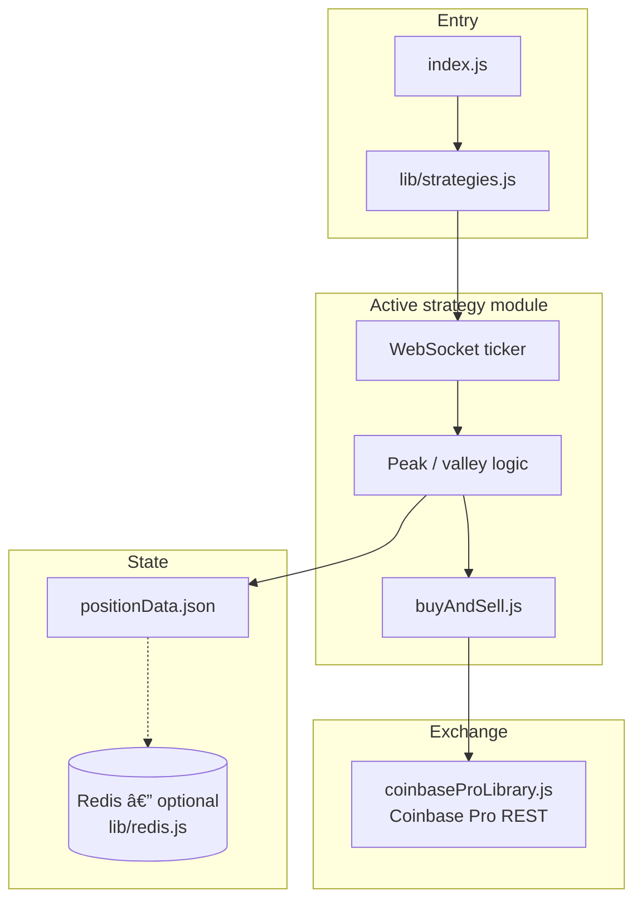
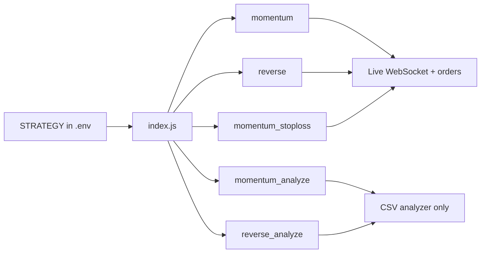

# Coinbase Trading Bot (Legacy)

> **Node.js peak/valley momentum** strategies with optional profit transfers, CSV backtests, and a single CLI entrypoint — built for the **legacy Coinbase Pro API**.

```text
  WebSocket ticker
        │
        â–¼
  Peak / valley tracker
        │
        â–¼
  Delta thresholds ──► Limit orders (FOK)
        │
        â–¼
  Optional profit transfer + position resume
```

Part of the [Coinbase Bot Suite](../README.md). For new integrations, prefer the TypeScript bots (`cross-exchange-arbitrage-bot`, `market-making-bot`, etc.) on **Advanced Trade**.

Originally inspired by the **CrypFinder** / Coinbase Pro ecosystem, this repo packages several strategies behind one entrypoint (`index.js`), central logging, environment validation, and npm scripts so you can experiment without hunting through commented-out requires.

---

## Important: Coinbase Pro and this codebase

Coinbase has **retired Coinbase Pro** in favor of Coinbase Advanced Trade. The `coinbase-pro` npm client and the REST/WebSocket URLs used here target the **legacy Coinbase Pro API**. They remain useful as **reference implementations** (strategy logic, order flow, backtests), but **production trading may no longer be available** on those endpoints.

Treat this project as:

- A **learning sandbox** for peak/valley momentum mechanics and limit-order workflows
- A **backtesting harness** over historical OHLC CSV files
- A **starting point** if you port the same ideas to [Coinbase Advanced Trade API](https://docs.cdp.coinbase.com/advanced-trade/docs/welcome) or another exchange

**Disclaimer:** Trading crypto carries risk of total loss. This software is not financial advice, has no warranty, and you are responsible for keys, compliance, taxes, and testing.

---

## Features

| Capability | Description |
|------------|-------------|
| **Momentum** | Buys on strength after a valley→peak move; sells when price retraces by your delta while covering fees and minimum profit. |
| **Reverse momentum** | Inverse framing: fades rallies and buys dips per your tuned deltas. |
| **Momentum + stop-loss** | Same core idea with an extra stop-loss threshold (`STOP_LOSS_DELTA`). |
| **CSV analyzers** | Replay strategies on minute OHLC data and summarize buys, sells, and P&L shape. |
| **Resume state** | Persists position metadata to disk (`positionData.json`) and optional Redis cache so restarts can continue safely. |
| **Profit skim** | Optional transfer of a fraction of realized profit to another portfolio/profile after a winning sell. |

---

## Quick start

### Prerequisites

- **Node.js 18+**
- A Coinbase **portfolio** (profile) dedicated to the bot — avoid the default portfolio if you move funds manually
- API key with appropriate permissions **if** you still have access to Coinbase Pro–compatible endpoints (see disclaimer above)

### Install

```bash
git clone <your-fork-url>
cd coinbase-trading-bot
npm install
cp .env.example .env
# Edit .env — never commit real keys
```

### Choose a strategy

Set `STRATEGY` in `.env` or pass via npm script:

| `STRATEGY` | npm shortcut | Needs API keys |
|------------|----------------|----------------|
| `momentum` (default) | `npm run start:momentum` | Yes |
| `reverse` | `npm run start:reverse` | Yes |
| `momentum_stoploss` | `npm run start:momentum-stoploss` | Yes |
| `momentum_analyze` | `npm run analyze:momentum` | No |
| `reverse_analyze` | `npm run analyze:reverse` | No |

```bash
npm start
# or explicitly:
npm run start:momentum
```

Live trading (when supported by your environment):

```bash
# In .env:
TRADING_ENV=real
API_KEY=...
API_SECRET=...
API_PASSPHRASE=...
```

Sandbox-style defaults apply when `TRADING_ENV` is unset or not `real`.

### Backtesting

1. Obtain OHLC CSV data with a **`high`** column (see [Kaggle crypto minute data](https://www.kaggle.com/datasets) or similar).
2. Place the file in the project directory (or reference an absolute path).
3. Set in `.env`:

```bash
CSV_DATA_FILE=your_pair.csv
STRATEGY=momentum_analyze   # or reverse_analyze
```

4. Tune constants at the top of the analyzer file under `tradingConfig`, then:

```bash
npm run analyze:momentum
```

---

## Configuration reference

All secrets and overrides belong in **`.env`** (see `.env.example`).

**Credentials**

- `API_KEY`, `API_SECRET`, `API_PASSPHRASE` — Coinbase Pro–style API trio
- `TRADING_ENV` — `real` for production URI; otherwise sandbox URIs are used

**Trading knobs** (optional; defaults live in each strategy file)

- `SELL_POSITION_DELTA`, `BUY_POSITION_DELTA`, `ORDER_PRICE_DELTA`
- `BASE_CURRENCY_NAME`, `QUOTE_CURRENCY_NAME` — e.g. `BTC` + `USD` → `BTC-USD`
- `TRADING_PROFILE_NAME`, `DEPOSIT_PROFILE_NAME` — portfolio names as shown in Coinbase
- `DEPOSITING_ENABLED`, `DEPOSITING_AMOUNT` — profit transfer after winning sells
- `BALANCE_MINIMUM` — quote currency left aside to avoid rounding failures
- `STOP_LOSS_DELTA` — **momentum_stoploss** only

**Paths**

- `POSITION_DATA_FILE` — state file for resume (default `positionData.json`)
- `CSV_DATA_FILE` — input for analyzers

**Logging**

- `LOG_LEVEL` — e.g. `info`, `debug`

---

## How strategies think (short)

1. **WebSocket ticker** keeps a live price for the product pair.
2. The bot tracks **peaks and valleys** and compares moves against your **delta** thresholds.
3. **Limit orders** (`FOK`) try to buy or sell with a small **order price cushion** (`ORDER_PRICE_DELTA`).
4. After a profitable round-trip sell, an optional **profile transfer** moves part of the profit to your savings portfolio.

For a narrative deep-dive, see the markdown files under `strategies/*/`.



---

## Restarting and `positionData.json`

If the process stops, it reads `POSITION_DATA_FILE` to restore `positionExists`, acquisition price, and cost. Do not manually add coins to an open position the bot thinks it owns — cost basis will be wrong.

To start fresh: flatten the position in the UI for that portfolio, then delete your position state file (default `positionData.json`).

---

## Project structure

```text
coinbase-trading-bot/
├── .env.example                 # API keys, strategy, trading knobs
├── package.json                 # start:* and analyze:* scripts
├── index.js                     # Loads .env, validates env, runs STRATEGY
│
├── buyAndSell.js                # Shared limit-order buy/sell (FOK)
├── coinbaseProLibrary.js        # Signed REST — profiles, fees, transfers
│
├── lib/
│   ├── logger.js                # Shared Pino logger
│   ├── paths.js                 # positionData.json path resolver
│   ├── strategies.js            # Strategy registry (STRATEGY → module)
│   ├── validateEnv.js           # API key presence checks
│   ├── redis.js                 # oscar-redis client (optional)
│   ├── positionStore.js         # Disk + Redis position persistence
│   └── cache/
│       └── store.js             # In-memory fallback cache
│
└── strategies/
    ├── momentumTrading/
    │   ├── momentumTrading.js           # Live momentum bot
    │   ├── momentumTradingAnalyzer.js   # CSV backtest
    │   └── momentumTrading.md           # Strategy write-up
    ├── momentumTradingWithStopLoss/
    │   ├── momentumTradingWithStopLoss.js
    │   └── momentumTradingWithStopLoss.md
    └── reverseMomentumTrading/
        ├── reverseMomentumTrading.js
        ├── reverseMomentumTradingAnalyzer.js
        └── reverseMomentumTrading.md
```

### Module map

| Path | Responsibility |
|------|----------------|
| `index.js` | Dotenv, credential validation, dispatches to selected strategy |
| `lib/strategies.js` | Maps `STRATEGY` env to the correct require |
| `buyAndSell.js` | Limit buy/sell with price cushion and fee awareness |
| `coinbaseProLibrary.js` | Low-level signed HTTP for Pro endpoints |
| `lib/positionStore.js` | Saves `positionExists`, cost basis — file + optional Redis |
| `strategies/*/…Analyzer.js` | Offline CSV replay (no API keys) |

### Strategy selector



---

## Development

```bash
npm test          # position store unit tests
npm run lint
```

---

## Contributing

1. Fork the repository
2. Create a branch for your change
3. Run `npm run lint`
4. Open a pull request with a clear description

---

## Credits & license

Based on prior CrypFinder / Coinbase Pro bot work by Levi Leuthold and community forks. Licensed under **ISC** unless otherwise noted in `package.json`.

---

## Links

- [Coinbase Developer Platform (Advanced Trade)](https://docs.cdp.coinbase.com/) — migration path for new integrations
- [Historical crypto OHLC ideas](https://medium.com/coinmonks/how-to-get-historical-crypto-currency-data-954062d40d2d)
- Community datasets on [Kaggle](https://www.kaggle.com/datasets)
